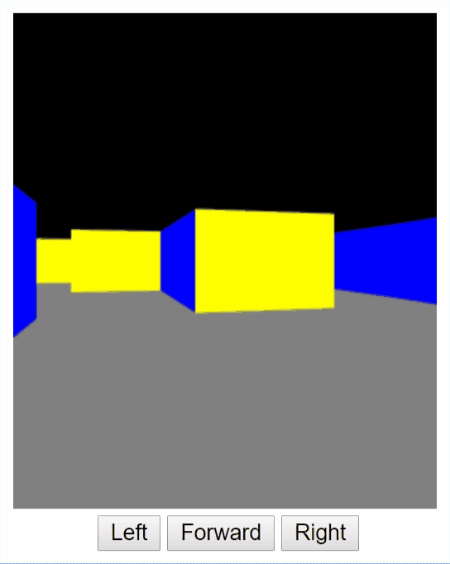
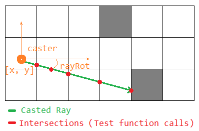

# TS RayCasting


Small raycast library

## Overview



*(a small example of raycasting, check [source code of this example](example))*

### Features

- [x] casting a custom number of rays from camera position with specific direction
- [x] normalizing angle to be `<0, Math.PI * 2>`
- [x] removing fisheye effect
- [x] checking every ray intersection with world cell
- [ ] checking x and y position in world in test function
- [x] option to cast rays from center of FOV
- [x] checking distance in test function
- [x] optional fisheye effect
- [ ] CONTINUE, SKIP or STOP in testintersection
- [ ] fixed-length sized arrays
- [ ] quadrants as enum flags
- [ ] npmjs

### API



#### castRay(map, x, y, intersection, rayRot)

```typescript
castRay(map: number[][], x: number, y: number, intersection: testintersection, rayRot: number): IRay
```

Will cast ray from position in map, which is two-dimensional world of numbers, where
every number means a specific wall. To check if ray already hit a wall, there's **intersection**
callback. If testfunction returns false, then it'll stop casting ray further and
it means that wall was hit.

#### castRays(map, x, y, rot, intersection, config)

```typescript
castRays(map: number[][], x: number, y: number, rot: number, intersection: testintersection, config: IRayConf = defaultConfig): IRay[]
```

Will cast several rays from position in map, which is two-dimensional world of numbers,
where every number means a specific wall. *rot* is direction of camera or caster.
To check if ray already hit a wall, there's **intersection** callback.
If testfunction returns false, then it'll stop casting ray further and it
means that wall was hit.

#### intersection(row, column, dist, index)

```typescript
type testintersection = (row: number, column: number, dist: number, index: number) => boolean;
```

It's same callback in both **castRay** and **castRays** function, where is put a
logic of hitting a wall. If testFunctions returns false, it'll stop casting
ray further (specific ray, not all rays in **castRays** function).

## How to use

First, you need import a ts-raycasting library into your project

```typescript
import tsrays from 'ts-raycasting';
```

and have 2D map created. For example binary map. 1 means wall, 0 = empty space.

```typescript
const my2DMap =  [
    [1, 1, 1, 1, 1, 1],
    [1, 0, 0, 0, 0, 1],
    [1, 0, 0, 0, 0, 1],
    [1, 0, 0, 0, 0, 1],
    [1, 0, 0, 0, 0, 1],
    [1, 1, 1, 1, 1, 1],
];

const camX = 3.5;   // starting camera position, column 3.5
const camY = 3.5;   // starting camera position, row 3.5
const rot = 2.34;   // camera direction in radians
const fov = 75;     // field of view angle
const count = 256;  // how many rays to cast
```

to cast rays from point, use **castRays** function, and test every intersection that ray makes.
If ray hit a block, return *false* to stop casting ray further and then check position of ray hit in the world (map).

```typescript
// casting ray from a camera
const rays: IRay[] = tsrays.castRays(my2DMap, camX, camY, rot, (row: number, column: number, dist: number, index: number): boolean => {
    if (my2DMap[row][column] === 1) {
        // Wall hit !
        return false; // stop casting ray further
    } else {
        return true; // continue with casting ray
    }
}, {fov: fov, count: 256, fisheye: false});
```

## Scripts

- `npm run build` build library, everything will be in `dist/` folder
- `npm run build:web` build minified raycast library for browser
- `npm run build:node` build library with all declaration files
- `npm run build:example` build examples
- `npm run lint` lint all .ts files
