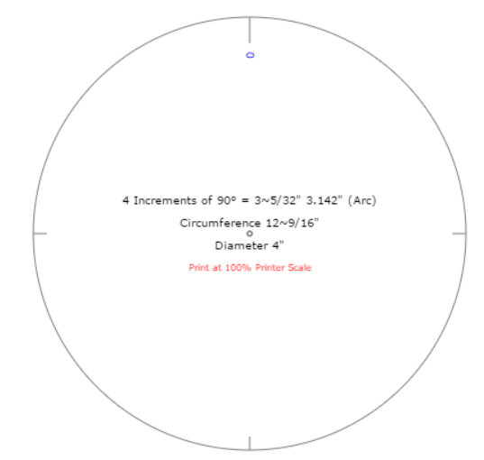
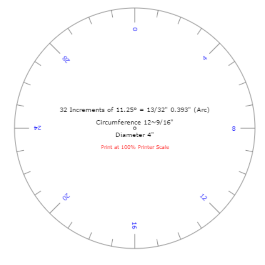
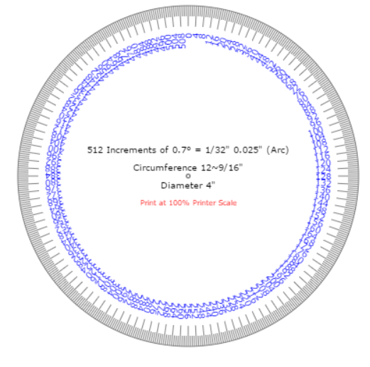

# Lookup Tables

## Why

Because of better performance, app doesn't need to generate `Math.cos(x)`
on the fly, instead it'll obtain values from lookup table like `cosLookupTable[x]`.
It's much faster than doing `Math.cos(x)` everytime we need it.
Those lookup tables are generated at the start of app (for better loading time, we
can have those lookup tables already generated in some file).

## How

Before starting with generating lookup table for every trigonometry function,
we need to define how many increments are available in circle.

Example of circle with 4 increments. *Just example*

Example of circle with 32 increments. *Wee need more*

Example of circle with 512 increments. *Okay, that's enough*

You can play with circle increments at [http://www.blocklayer.com/circle-dividereng.aspx](http://www.blocklayer.com/circle-dividereng.aspx)

So we should generate 4 lookuptables (Sin, Cos, Tan, CTan) with length 512.
